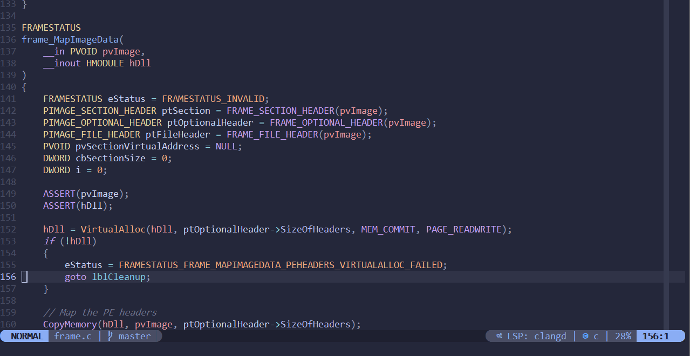

# My Personal NeoVim config

Configured to utilize:
- LSP
- Code and snippet completion
- Auto installtion of dependencies
- Telescope
- Treesitter
- DAP (for python)

As well as personal settings for all plugins and features.
